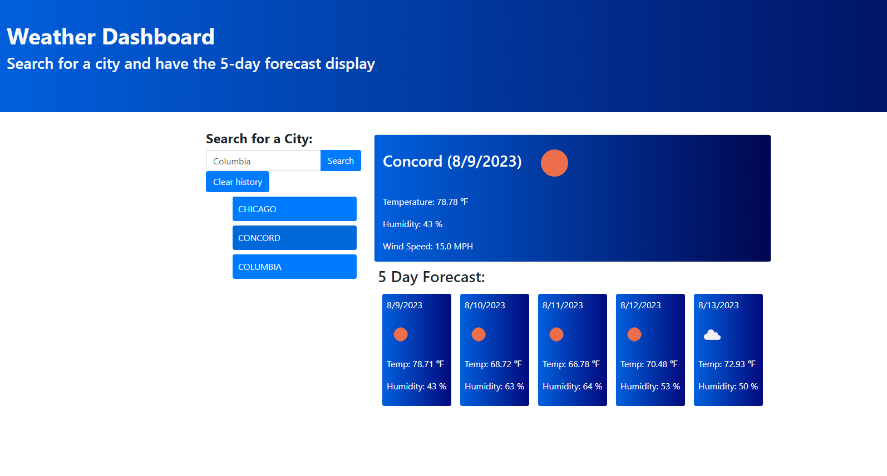

# Weather Dashboard

## Description

This is a simple weather dashboard application where the user can input a name of a city and it will display the current forecast for the day and a 5 day breakdown of the future forecasts. Previously searched cities will be saved in local storage with an option to clear the search history with a button. For future updates I would like to implement a geolocation option where the application will automatically know where the user is located and display the forecast for their location. 

## Screenshot

## Link to Deployed Page

https://alexanderlocke.github.io/weather-dashboard/

